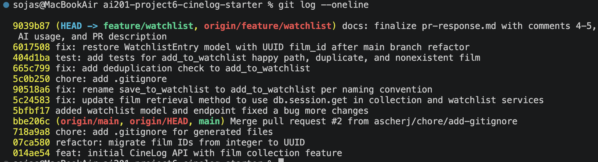

# PR Response Doc — CineLog Watchlist Feature

## Commit History



## AI Usage
I used Claude throughout this project for several specific purposes:

- **Codebase orientation:** Had Claude help me understand the existing patterns in `collection_service.py` and `test_collection.py` (naming conventions, the dedup-check pattern, test fixture structure) before touching the watchlist code, so I could follow the same patterns rather than reinvent them.
- **Debugging:** Used Claude to diagnose the `ImportError` when the route file referenced a function name that no longer matched the service file, and later to diagnose a silent `WatchlistEntry` model loss during the `git rebase` (git didn't flag it as a conflict, but the test suite caught it).
- **Git/rebase mechanics:** Asked for step-by-step guidance on resolving the `.gitignore` add/add conflict and continuing the rebase, since I hadn't done an interactive or conflict-resolution rebase before.
- **Stress-testing Comments 4 and 5:** After I wrote my own draft positions on default visibility and sort order, I asked Claude to critique them as a skeptical reviewer would. For Comment 4, it flagged that I was understating the tradeoff of a private default (asserting "opt-in preserves functionality" without acknowledging that most users never change defaults) and asked whether I was confident in flipping the default vs. just documenting the existing one. For Comment 5, it pointed out I'd stated "watchlists are typically short" as fact without evidence, and noted that my fallback to "search/filtering" wasn't accurate since the watchlist endpoint doesn't currently have that feature. I chose to keep my original arguments as written, since I stand behind the reasoning, but the critique helped me confirm I'd actually thought through the weak points rather than just asserting them.


## Comment 1 — Rename

> "save_to_watchlist() should follow the project's naming convention. Compare with add_to_collection() — the pattern here is verb_to_noun. Please rename to add_to_watchlist() and update all call sites." — @dev-lead

**What I did:** The service function in `services/watchlist_service.py` was already named `add_to_watchlist`, but `routes/watchlist/watchlist.py` still imported and called the old `save_to_watchlist` name, which caused an `ImportError` on startup. I updated the import and the call site in the route file to use `add_to_watchlist`.

**How I verified:** Ran `grep -rn "save_to_watchlist" .` to confirm no remaining source references (only a stale compiled `.pyc` file matched). Confirmed `python3 app.py` starts without the ImportError, and the full test suite (`pytest tests/ -v`) still passes.

## Comment 2 — Deduplication

> "What happens if a user calls this with a film that's already on their watchlist? The current implementation would add a duplicate entry. Please handle this case." — @dev-lead

**What I did:** Added an `AlreadyInWatchlistError` exception class and a duplicate-check in `add_to_watchlist()`, mirroring the existing pattern in `add_to_collection()` (query for an existing entry before inserting, raise if found). I defined a watchlist-specific exception rather than reusing `AlreadyInCollectionError`, since "already in collection" and "already in watchlist" are different failure conditions and conflating them would mislead anyone reading the raised exception. I also updated `routes/watchlist/watchlist.py`'s `add_film` view to catch both `FilmNotFoundError` and `AlreadyInWatchlistError` and map them to 404/409 responses — previously neither exception was caught, so both cases would have caused an unhandled 500 error.

**How I verified:** Full test suite passed after the change. This was later directly confirmed by the duplicate test added in Comment 3, which exercises this exact code path.

## Comment 3 — Missing test

> "Please add a test for the case where film_id doesn't exist in the database. Look at the existing tests in test_collection.py — the pattern is there." — @dev-lead

**What I did:** Created `tests/test_watchlist.py`, mirroring the fixture and test structure of `tests/test_collection.py` (`app`, `sample_user`, `sample_film` fixtures redefined locally, since fixtures aren't shared across test files without a `conftest.py`). Wrote the required test for a nonexistent `film_id` (using a fake integer ID, since this branch predates the UUID refactor, unlike the collection tests' UUID string). I also added a happy-path test and a duplicate test, following `CONTRIBUTING.md`'s stated standard that new service functions need a happy-path test, a duplicate/conflict test, and a nonexistent-ID test — this also gave me actual proof that the Comment 2 dedup logic works, not just that it doesn't break other tests.

**How I verified:** `pytest tests/ -v` — all 7 tests pass (4 pre-existing collection tests + 3 new watchlist tests).

## Comment 4 — Default visibility

**My position:**  
I agree that `public=False` should remain the default for watchlist entries.

**Reasoning:**  
A watchlist represents a user's future intentions rather than something they've already watched. Unlike a collection, which reflects completed viewing history and is generally meant to be shared, a watchlist can reveal interests that a user is still deciding on or may not want others to see. The fact that `WatchlistEntry` includes a `public` field while `CollectionEntry` does not suggests the original design intentionally recognized that watchlists have different privacy expectations. Defaulting to private follows an opt-in privacy model, which is easier to reverse—a user can always choose to make an item public later, but they cannot undo the fact that something was unintentionally exposed.

**Tradeoff acknowledged:**  
Keeping watchlists private by default does reduce opportunities for social discovery, since friends won't automatically see what someone plans to watch. That is a real tradeoff for a community-focused app like CineLog. However, allowing users to opt in to sharing preserves that functionality while avoiding accidental exposure of personal interests.

## Comment 5 — Sort order

**My position:**  
I agree with sorting watchlists by date added (newest first).

**Reasoning:**  
When users open a watchlist, they're often trying to remember what they most recently decided to watch rather than searching for a title alphabetically. Showing the newest additions first keeps recent decisions visible and makes it easier to continue from where they left off. This also matches the existing behavior of `get_collection()`, creating a more consistent experience across both features so users don't have to adjust to different ordering rules.

**Engagement with reviewer's point:**  
Alphabetical ordering is better when the goal is finding a specific movie in a very large watchlist. However, I don't think that use case outweighs the benefits of recency for most users, since watchlists are typically used as short, active queues. If locating a specific title becomes a common need, search or filtering would address that more effectively than changing the default sort order.

## Comment 6 — Rebase

> "A refactor merged to main that changed film IDs from integers to UUIDs. Your watchlist code still references integer IDs. Please rebase on main and update accordingly." — @dev-lead

**What conflicted:** Running `git rebase origin/main` first hit an add/add conflict in `.gitignore` — both my branch and the updated `main` had independently added a `.gitignore` file with mostly overlapping entries. After resolving that, the rebase reported success with no further conflicts, which was misleading: it silently dropped the `WatchlistEntry` class from `models.py` during the replay (git didn't flag this as a conflict, since the surrounding file structure shifted enough during the UUID refactor that git didn't detect an overlap — but the class itself was gone). This wasn't apparent until I ran the test suite and got `ImportError: cannot import name 'WatchlistEntry' from 'models'`.

**How I resolved it:** For the `.gitignore` conflict, I merged both versions into one file, keeping all entries from each side (the shared entries plus `.DS_Store`, which only my branch had added). For the missing `WatchlistEntry` class, I manually re-added it to `models.py`, this time using `db.String(36)` (UUID) for `film_id` instead of the original `db.Integer`, matching the pattern used by the post-refactor `Film.id` and `CollectionEntry.film_id`. I also updated the stale `add_to_watchlist()` docstring (which still said "integer — pre-refactor") and updated `test_watchlist.py`'s nonexistent-film fixture to use a fake UUID string instead of a fake integer, matching how `test_collection.py` already tests this case.

**How I verified no conflict remains:** Ran `pytest tests/ -v` after the fix — all 7 tests pass, including the previously-failing `test_watchlist.py` import. Confirmed via `git log --oneline` that my four feature commits now sit on top of `main`'s refactor commit (`07ca580 refactor: migrate film IDs from integer to UUID`) rather than the old pre-refactor base, and that no merge commits appear in the history.

## PR Description

**What this feature does:**
Adds a watchlist feature to CineLog, allowing users to save films they intend to watch (as opposed to the existing collection feature, which tracks films they've already watched). Includes a `WatchlistEntry` model, `add_to_watchlist()` and `get_watchlist()` service functions, and two REST endpoints: `GET /watchlist/<user_id>` and `POST /watchlist/<user_id>/add`.

**Design decisions:**
- **Default visibility:** Watchlist entries default to `public=False`. Unlike a collection (completed viewing history, generally safe to share), a watchlist reveals a user's current intentions and unsettled interests, which carries different privacy expectations. Users can opt in to making entries public. See Comment 4 in this doc for full reasoning.
- **Sort order:** `get_watchlist()` returns entries sorted by date added, newest first — matching the existing behavior of `get_collection()` for consistency, and because users most often want to see what they recently decided to watch. See Comment 5 in this doc for full reasoning.

**How to manually test:**
1. Start the app: `python3 app.py`
2. Create a user and a film in the database (via the existing `/collection` or seed data, or directly via a Python shell using the `User`/`Film` models).
3. Add a film to a user's watchlist:
```bash
   curl -X POST http://127.0.0.1:5000/watchlist/<user_id>/add \
     -H "Content-Type: application/json" \
     -d '{"film_id": "<film_uuid>"}'
```
   Expect a `201` response with the new entry, including `"public": false`.
4. Attempt to add the same film again — expect a `409` response with an "already in this user's watchlist" error.
5. Attempt to add a nonexistent film ID — expect a `404` response.
6. View the watchlist:
```bash
   curl http://127.0.0.1:5000/watchlist/<user_id>
```
   Expect a list of films sorted newest-added first.
7. Run the automated test suite: `pytest tests/ -v` — all 7 tests should pass.